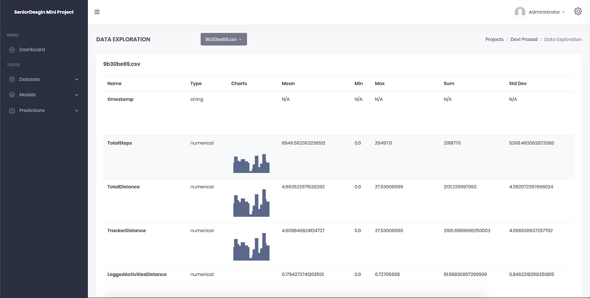
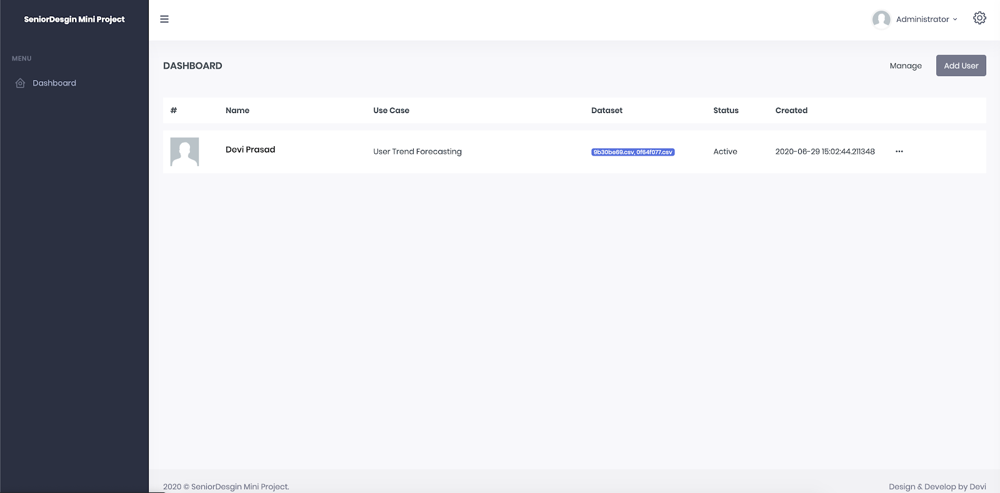
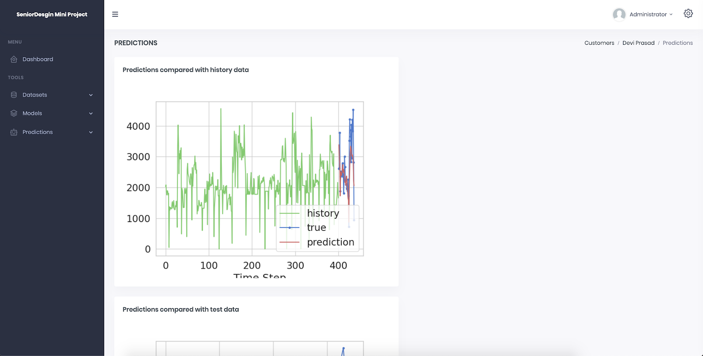
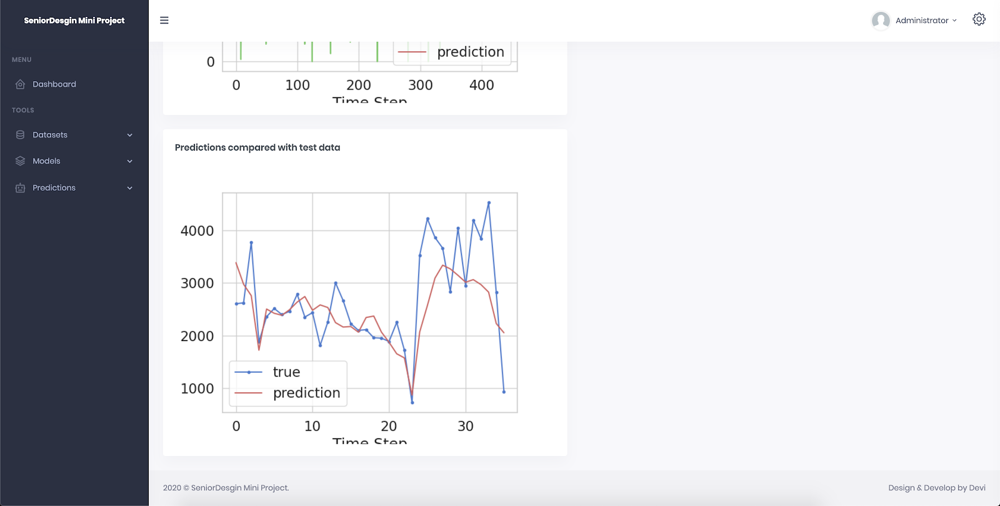

.. Requests documentation master file, created by
   sphinx-quickstart on Fri Aug 14 23:54:25 2020.
   You can adapt this file completely to your liking, but it should at least
   contain the root `toctree` directive.

FitBackend: StateFarm Ingenuity Senior Design 2020 (Spring/Summer)
==========================

Release v\ |version|. (:ref:`Installation <install>`)

    
.. image:: https://img.shields.io/pypi/l/requests.svg
    :target: https://pypi.org/project/requests/

.. image:: https://img.shields.io/pypi/wheel/requests.svg
    :target: https://pypi.org/project/requests/

.. image:: https://img.shields.io/pypi/pyversions/requests.svg
    :target: https://pypi.org/project/requests/

**FitBackend** is a combination of various components to allow end to end machine learning.

1. Backend API
2. Admin UI View
3. Database Manager
4. Machine Learning Cron Job
5. Customer UI View

| Code: https://github.com/statefarmuta/api_ml_admin \n
| Backend API Documentation: THIS DOCUMENT
| 
| CustomerUI Documentation: https://github.com/statefarmuta/api_ml_admin/blob/master/app/web/doc/documentation.pdf
| CustomerUI root: https://github.com/statefarmuta/api_ml_admin/tree/master/app/web

| MobileTeam Repo: https://github.com/deviprasad97/senior-design-codebase
| MobileTeam Documentation: https://github.com/deviprasad97/senior-design-codebase/blob/master/MobileTeamDocumentation.docx
-------------------

**FitBackend** works as the brain for this project. There are multiple components:

**1. Backend API**::
Backend API is strict API that allowsmultiple application to intreact with the backend without rewritting the code again and again. 
The API is standard REST API that can be integrated with Android, python or any other mordern porgramming langauge code base. 
Refer API section to know more.

**2. Admin UI View**::
Allows developer, sytems engineer, data scientists to interact with the platform and manages customer and their resources. 
It is also the gateway to manually trigger end to end ml traning process, manual data ingestion process. It also has lots
of Visualization to aid data scientists, and also has some Visualization that end users will also see.

.. image:: _static/view1.png

**3. Database Manager**::
As a part of the backend DB Manger is build to intreact with Database and perform transactions. Due to the nature of this project
and huge team it was particulary hard to quality control on the code and have everyone write in on fashion. So there are sections 
of the code where DBMgr system design has been voilated and direct aceess to the database has been made. Future teams will need to 
rectify this. It would be ideal to intreact with API from the controller or use the DBMgr.

**4. Machine Learning Cron Job**::
There are two different modules that deal with Cron jobs. First is a ML Cron Job that trains a deeep learning model asynchronously
using redis-qeue (rq) and redis server. The redis worker is initilized in 'app/__init__.py' 

.. image:: _static/redisinit.png

and then the queue **q** is used to delegate the task to queue. There is a seperate module refer to cronjobs_python folder for 
all other modules that are required to run cron jobs like retriving files from S3 bucket, setting up user dirs when registration is triggered etc.
File under models/dl_models/tasks.py has a definations for various deep learing models.

**NOTE:** the corn jobs are not production ready. And due to time limitation its S3 bucket job has not been updated to work with mobile team's schema
as mobile team got the feautre in last moment. Check the mobile team code. Ideally you would want a folder structure with user_id name and inside that 
various artifacts to in their respective dirs. Also, the mobile team has their code setup to send data on a per day basis, THAT NEEDS TO BE CHANGED for 
machine learning to WORK, sample data set is included with the project check dataset folder that has data for every 15 mins.
Machine Learning CAN NOT WORK with sparse data (30 rows a month) so Android logic would need to change to collect data every 15 mins and send ONE CSV at 
the end of the day. Ideally you should use AWS Kenisis to stream data to it and then code for AWS kenisis to combine all sent data at end of the week and 
upload to S3 Bucket. This is one requirement given to Mobile team but was not fulfilled. Check their documentation for more information.

**5. Customer UI View**::
Allows customer to interact with the platform and manages customer and their resources. It shows various Visualization and data collected from fitbit.
The customer UI is a seperate module and is integrated with the Backend API as a blueprint. Read the *Web application team-transition documentation* for
more information.
There a some part of the code that calls upon the Backend API, some part the uses Database Manger and some part that access the database directly.
Ideally this needs to be its now service, and VIEW only meaning it should not all Database Manger or access the database directly inseted it should call the 
Backend API and request the associated task. If an API for a particular task in not built then then it needs to be implemented in Backend API in view.py
The customer UI view is located under app/web folder. It has it seperate routes.

Beloved Features
----------------

FitBackend API is ready for POC and can support upto 100 users (It is not production ready).

- Keep-Alive & Connection Pooling
- Sessions with Cookie Persistence
- Basic/Digest Authentication
- Automatic user auth revoke (seperate package see OAuth2.0, not integrated)
- User profile and Data stream
- Redis powered Cron Jobs
- End to end AutoML
- Transformer Deep Learning Model
- ConvLSTM Deep Leanring Model

FitBackend Admin View is built and ready for Data Scientists and Admins to manage the platfrom

- Admin Login
- Admin Customer Registration
- Admin All Customer view Dashboard
- Data Pipeline view
- Data manual ingestion trigger
- Data Exploration and Visualization
- Manual Deep Learning traning trigger
- Model Prediction Visualization
- Customer Preformance Visualization

FitBackend officially supports Python 3.6, refer to the installtion page for more information (:ref:`Installation <install>`).

The User Guide
--------------

This part of the documentation, which is mostly prose, begins with some
background information about FitBackend, then focuses on step-by-step
instructions for getting the most out of FitBackend.

.. toctree::
   :maxdepth: 2

   user/infra
   user/install
   user/authentication
   
   

The API Documentation / Guide
-----------------------------

If you are looking for information on a specific function, class, or method,
this part of the documentation is for you.

.. toctree::
   :maxdepth: 2

   modules
   app

There are no more guides. You are now guideless.
Good luck.
