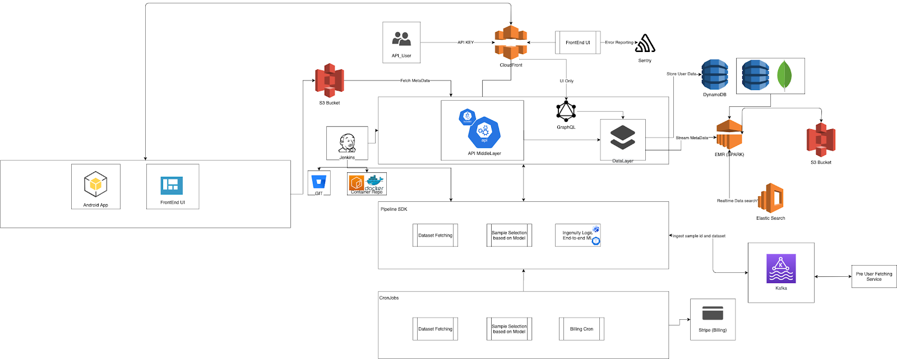
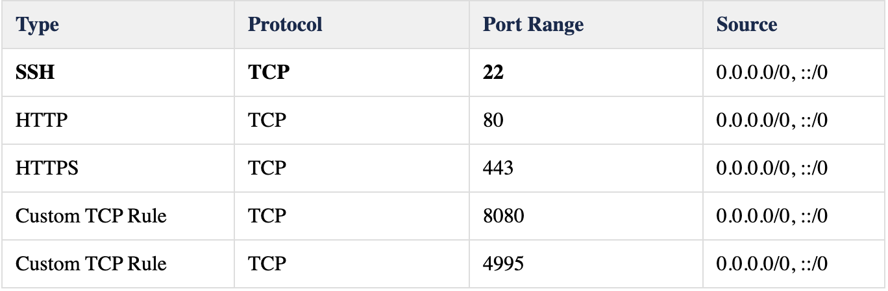

.. _infra:

Infrastructure
==============

.. image:: https://farm5.staticflickr.com/4317/35198386374_1939af3de6_k_d.jpg

AWS Infrastructure
------------------


The above is ideal production system. This poject does not have most of the above feautres. I created that diagram is a benchmark to acheive.
The current system is deployed on AWS EC2 instance.
The python code has runs on Nginx Server (See installation for more info)
The Redis server is installed and deployed to handle Cron Job.

The are 3 main corn jobs as depicted in the picutures running on redis enviromenet responsible for training the model, fetching data form S3
and creating all the user directories required.

The database is hosted on mongoDB, and pymongo is used to interface with the database.

The entire set up is avalible as virtual disk as well at: 


**Set up EC2**

EC2 Instance setting

Launch **Ubuntu Server 18.04 LTS (HVM), SSD Volume Type** -
ami-07ebfd5b3428b6f4d (64-bit x86)

For the purpose of development here are some recommended setting:

Instance Type: t2.medium (choose t2.micro for test)

Storage: 140 GB (Data, python, docker will take space) (Choose 30 gb for
test)

Security Group add following rules




We will be using SFTP for the file transferring if needed.

Next create a new key pair.

Key name: statefarm

**THEN DOWNLOAD THE KEY** and keep it safe, upload it to google drive
make multiple copies of it.

Finally launch instance.

After the instance is launched with **instance state** == **running**
right click on the instance and click connect.

Follow the instruction of the screen:

1. Your key must not be publicly viewable for SSH to work. Use this
   command if needed:

   chmod 400 plex.pem

2. Connect to your instance using its Public DNS:

   ec2-23-22-253-158.compute-1.amazonaws.com

**Example:**

ssh -i "plex.pem" ubuntu@ec2-23-22-253-158.compute-1.amazonaws.com

If you are using windows 😒 LOL, you have to download PuTTY or configure
WSL on windows. Not going to cover that here.

Ubuntu and Mac users should be all ready to work off the Ubuntu cloud
machine.

Switch to correct Kernal Version
--------------------------------

1. Log in to PC after setting up the above things.

2. run \```uname -r``\`

   1. Validate that the version is NOT 5.3.0-28-generic for ubuntu 18.04
      , it this is the version please SKIP to the next section.

3. Run the following commands

   1. sudo apt-get update

   2. Download Appropriate Kernel Version

      1. Ubuntu 18.04

         1. sudo apt-get install linux-headers-5.3.0-28-generic

         2. sudo apt-get install linux-image-5.3.0-28-generic

   3. ``grep submenu /boot/grub/grub.cfg``

      1. ``Pick the menuentry_id_option from here, I'll call it menuentry_1``

   4. grep gnulinux /boot/grub/grub.cfg

      1. Pick the menuentry_id_option that is for the X-45-generic
         option, ill call it menuentry_2

   5. sudo vi ``/etc/default/grub``

   6. Change the "GRUB_DEFAULT" option to "menuentry_1>menuentry_2" -
      note the ">" in between 1 and 2.

   7. click "esc" then ":wq"

   8. \`sudo update-gr

.. _Documentation: index.html
.. _Setup Development Machine: Setup-Development-Machine_3768333.html

Code Infrastructure
-------------------

Coming Soon


Database Schema
---------------

Coming Soon